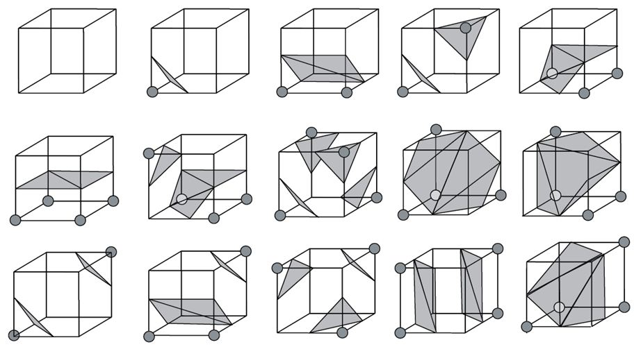

# CG_MarchingCube

# CG_ClothSimu  
  
The codes related to the assignment are in "/Script/Implict.gd"  

### Preview  
  
There is some holes in the combination of F1, F2 and F3 but I can not figure out why.
Also, did not have enough time to implement surfaces' normal.

Patterns(numbered from up-left to down-right)  
  
http://vis.pku.edu.cn/blog/wp-content/uploads/2011/10/marchingcubes.jpg  

### Usage  

Download godot 3.5  
https://github.com/godotengine/godot/releases/tag/3.5-stable  

Click import and put all the files into the path  
  

### Reference
Lorensen, William E., and Harvey E. Cline. "Marching cubes: A high resolution 3D surface construction algorithm." Seminal graphics: pioneering efforts that shaped the field. 1998. 347-353.
